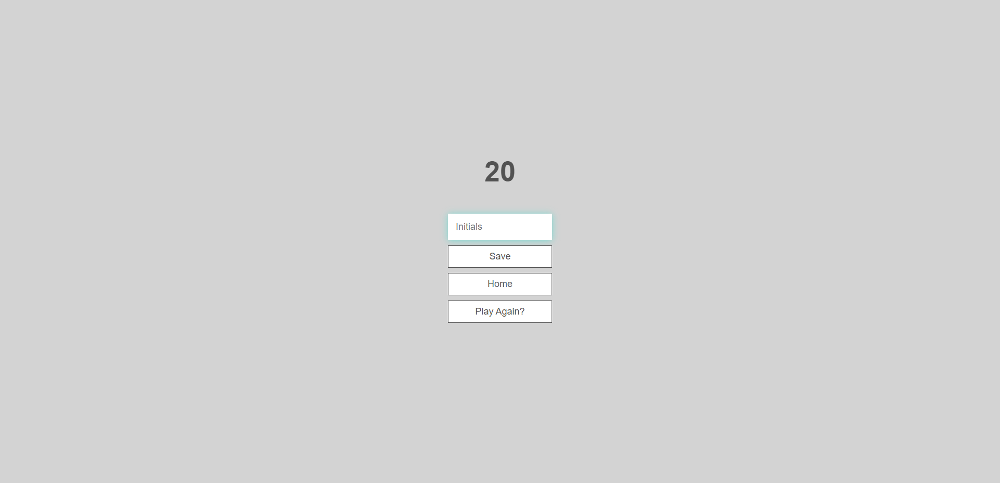

# Coding Quiz

The coding quiz is a short survery that tests your aptitude in coding, althought short is shows a lot of Javascript components, local api usage, and UI design. The quiz was made to practice api's as well as javascript.

# Deployment
[Click here!](https://jasiela22.github.io/Code-quiz-/)

# What to Expect

## Starting screen

The starting page to start the quiz

## Playing quiz

This shows how the quiz looks like while going on

## Your score screen

The end screen with your score

## High Scores / End Screen

The final screen showing previous scores and who had the highest score according to the initials

# Sources and Credits

Youtube helped tons, specifically [James Q Quick](https://www.youtube.com/watch?v=u98ROZjBWy8&list=PLDlWc9AfQBfZIkdVaOQXi1tizJeNJipEx), which helped me set up most of my html and css as well as a lot of the Javascript

# Helpful People

Special thanks to Bradely and Walter for helping me get the finishing touches as well as Fabien and James Kelly